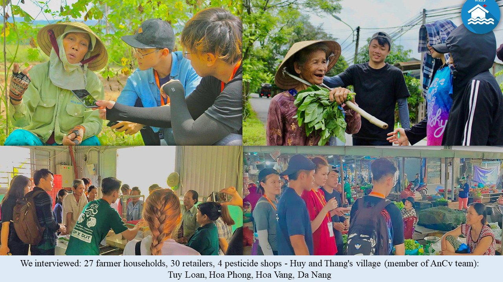

<!-- PROJECT LOGO -->

# AnCv_SF_UH21

<br />
<p align="center">
  <a href="https://github.com/uptimum/AnCv_SF_UH21">
    
  </a>

  <h1 align="center"><b>WREF</b></h1>

  <p align="center">
    <b>Mobile Agriculture Application</b>
    <br />
    Provide the best services to Vietnamese farmers and pesticide shops
    <br />
    <br />
    <a href="https://github.com/othneildrew/Best-README-Template">View Demo</a>
    ·
    <a href="#">Report Bug</a>
    ·
    <a href="#">Request Feature</a>
  </p>
</p>

<details open="open">
  <summary>Table of Contents</summary>
  <ol>
    <li>
      <a href="#about-the-project">About The Project</a>
      <ul>
        <li>
          <a href="#application-for-farmers">Application for farmers</a>
        </li>
        <li>
         <a href="#application-for-pesticides-retailers">Application for retailers</a>
        </li>
      </ul>
    </li>
    <li>
      <a href="#tech-stack">Tech Stack</a>
      <ul>
        <li>
          <a href="#technology-used">Technology used</a>
        </li>
        <li>
          <a href="#technology-used">Core technologies</a>
        </li>
      </ul>
    </li>
    <li>
      <a href="#how-to-run-this-project">How to run this project</a>
      <ul>
        <li>
          <a href="#setup-api-server">Setup API Server</a>
        </li>
        <li>
          <a href="#setup-wref-app">Setup WREF app</a>
        </li>
        <li>
          <a href="#setup-wref-app-for-retailers">Setup WREF app for retailers</a>
        </li>
      </ul>
    </li>
    <li>
      <a href="#technology-in-detailed">Technology in detailed</a>
      <ul>
        <li>
          <a href="#ai-workflow">AI Workflow</a>
        </li>
        <li>
          <a href="#remote-sensing">Remote Sensing</a>
        </li>
      </ul>
    </li>
    <li>
      <a href="#references">References</a>
    </li>
  </ol>
</details>

## About The Project

**AnCv team** created the **WREF Mobile Agriculture App** to provide the best services to Vietnamese farmers and pesticide retailers. We use technology to help Vietnamese farmers, especially those in the Central region, overcome productivity challenges.

**The app connects with retailers** so they know the farmers' agricultural performance to improve their business and help sell the right products through a dedicated app for retailers odd.

<p  float="left" align="middle">
   
</p>

### Application for farmers

<br/>
<p  float="left" align="middle">
   
  
  
  
</p>

Farmers need **a cheap product** that solves all their problems: natural disasters, diseases, wrong pesticide products and low yields.

- Use AI to **recognize images and analyze diseases** on trees, therefore recommending solutions and products to use. ([**code here**](WREF-app/app/src/main/java/thang/com/wref/CameraPredictionScreen))
- Use RS and AI to **predict crop yields**. ([**code here**](WREF-app/app/src/main/java/thang/com/wref/MainScreen/Havest/CropYieldActivity.java))
- Use OpenWeather API and AI for **flood prediction** and **early weather forecast**. ([**code here**](https://github.com/ancv-hackatrix2021/AnCv_SF_UH21/blob/main/WREF-app/app/src/main/java/thang/com/wref/MainScreen/Disaster/Flood/FloodDisasterActivity.kt))
- Use OpenWeather API to **display the weather forecast** for the next 24h, 5 days. ([**code here**](WREF-app/app/src/main/java/thang/com/wref/MainScreen/Weather))
- **Agricultural knowledge** is obtained from [**Harvest Helper**][harvest helper link]. ([**code here**](WREF-app/app/src/main/java/thang/com/wref/MainScreen/Havest/HarvesthelperActivity.java))
- **Agricultural social networks** help farmers to share beautiful and happy moments when achieving results. ([**code here**](WREF-app/app/src/main/java/thang/com/wref/StoriesScreen))

In addition, farmers can also directly order agricultural tools, fertilizers, pesticides, etc. from the retailers in the app.

### Application for pesticides retailers

<br/>
<p  float="left" align="middle">
  
  
  
</p>

Pesticides retailers will use a **sub-application** to be able to post the products being sold in the store to the system, if a farmer places an order, they can clearly see the farmer's information. when they order products on the app.

- Statistics of the store's business activities. ([**code here**](retail_agent_werf/lib/screen/homePage.dart))
- Register to open an app store. ([**code here**](retail_agent_werf/lib/components/tabView/shop_tab_view.dart))
- Order Management. ([**code here**](retail_agent_werf/lib/screen/orderPage.dart))
- Import goods from companies providing products. ([**code here**](retail_agent_werf/lib/screen/goodsPage.dart))

## Tech Stack

### Platform used

- Font-End: [**Java**](https://www.java.com/), [**Kotlin**](https://kotlinlang.org/), [**Dart**](https://dart.dev/).

- Back-End: [**Node.js**](https://nodejs.dev/) (Express.js), [**Mongodb**](https://www.mongodb.com/).

- IDE: [**Android studio**](https://developer.android.com/studio), [**VS Code**](https://code.visualstudio.com/), [**Pycharm**](https://www.jetbrains.com/pycharm/).

- Build and train model: [**Google Colab**](https://colab.research.google.com/notebook?hl=vi)

### Core technologies

- [**Artificial Intelligent**](https://en.wikipedia.org/wiki/Artificial_intelligence)
- [**Remote Sensing**](https://en.wikipedia.org/wiki/Remote_sensing)
- [**OpenWeather API**](https://openweathermap.org/)

## How to run this project

### Setup API Server

To run the API Server on your local, your environment must have [**Node.js**](https://nodejs.dev/) and [**NPM**](https://www.npmjs.com/) installed on your computer.

1. Open `Server-wref` folder and create `node environment` using command:

```shell
npm install
```

2. Run server in **dev mode** using command:

```shell
npm run dev
```

This action will start the server in **port 3000** with [**Nodemon**](https://www.npmjs.com/package/nodemon) inspector.

The API Server provide many APIs for the mobile app including [**WREF app**](WREF-app) and [**WREF app for retailers**](retail_agent_werf).

3. Now, you can continue develop this server by add some new custom API. Or you can add, remove or modify some requests provided in the server router.

```js
// Some API using in this server
// You can find this code in `app.js` file

app.use('/api', apiLogin);
app.use('/api', apiInforAgri);
app.use('/api', passport.authenticate('jwt', { session: false }), apiPosts);
app.use('/api', passport.authenticate('jwt', { session: false }), apiUser);
app.use('/api', passport.authenticate('jwt', { session: false }), apiComment);
...
app.use('/', (req, res) => {
  res.render('index.ejs');
});
```

4. When you are ready to public this server, you can use [**Heroku**](https://www.heroku.com/) to host on the cloud.

> Here is the server we have developed on the cloud: **https://wref.herokuapp.com/**

### Setup WREF app

To run this app. You must have installed [**Android Studio**](https://developer.android.com/studio/install) and make sure **Android SDK with API Level 29** installed.

The app is located in [**WREF-app**][app path] folder. User your **Android Studio** to open it.

### Setup WREF app for retailers

This app is developed by [**Flutter Framework**](<(https://flutter.dev/)>). You must have installed it to continue develop it or run.

The app is located in [**retail_agent_werf**](retail_agent_werf) folder.

## Technology in detailed

In this section, we will present the details of all the core technologies using in this project.

### AI Workflow

#### Data collection:

There are all the datasets we use to train some models.

All the datasets located in [**AI/datasets**][datasets path] folder.

##### Rainfall Dataset

This dataset contains **rainfall**, **temperature** and **humidity** day by day from 1979 - 2012.


This image is the rainfall dataset from 2010 to 2016. In each frequency, temperature, humidity and rain fall is **almost repeat the same in each year**.

##### Water Flow Dataset

This dataset contains **rainfall** and **water flow** day by day from 1978 - 2006.


This image is the rainfall dataset from 2000 to 2006. In each frequency, rainfall and water flow is **almost repeat the same in each year**.

##### Crop Yield Dataset

This dataset contains **temperature**, **humidity**, **precipitation** and **yield area** month by month from 1997 - 2014. In each year, it has data from 17 districts.


This image is the crop yield dataset from 2010 to 2014.

##### Plant Village Dataset

We use the PlantVillage dataset consisting of about 87,000 healthy and unhealthy leaf images. It is divided into 38 categories by species and disease. We also end up transfer learning from MobileNet and use the weights from pre-training on ImageNet.


#### Data Processing

Because almost all of the models are using **RNN as core AI**. So we divided the dataset into many row. **Each row contain 5 - 10 history data** inside the dataset.

We also **use time as a field** in the training data because the type of dataset is time series.

#### Model Creation

##### Rainfall AI model

In this model, we use **Rain Fall dataset** to training. This model using RNN including **Bidirectional LSTM Network** and **Fully Connected Network**. The model structure is display below.


We trained this model in 100 epochs. Here is metrics' chart of this model calculated by [**MSE**][mse path] function:


As we can see, the result of this model is not good because the data in 1976 to 2014 is old and because of climate change, the model can't predict as much as a perfect model when the climate is normal.

But the model can predict a acceptable result with a small difference with the real value.


This is the result when we test this model on the testing dataset. The blue line is the real rainfall (mm) in real life and the orange line is the prediction ones.

##### Water Flow AI model

In this model, we use **Water Flow dataset** to training. This model just using normal Neural Network include many **Fully Connected Network** to build. The model structure is display below.


We trained this model in 100 epochs. Here is metrics' chart of this model calculated by [**MSE**][mse path] function:


As we can see, the result of this model good. The model can predict a result that is closing to the real value.


This is the result when we test this model on the testing dataset. The blue line is the real water flow (m3/s) in real life and the orange line is the prediction ones.

##### Crop Yield AI Model

In this model, we use **Crop Yield dataset** to training. This model combine of 2 small model:

1. Normal Neural Network contain many **Fully Connected Network** to get the specific properties of the data.
2. RNN using **Word Embedding** to extract feature and remember these features of the dictionary data including Soil Types, Districts, Plant's Types and Seasons.

The result of this **2 small model is combine to the main model** and go throwing many Fully Connected Networks to predict the result.


We trained this model in 100 epochs. Here is metrics' chart of this model calculated by [**MSE**][mse path] function:


As we can see, the result of this model is so good. The model can predict a result that is very closing to the real value with difference about 3 - 5 hundredweight.


This is the result when we test this model on the testing dataset. The blue line is the real Crop Yield Harvest (hundredweight/ha) in real life and the orange line is the prediction ones.

##### Plant Disease AI model

In this model, we use **Plant Village Dataset** to training. This model is transferred learning from **Mobile Net v1.0** model developed by Google.

We have just replace and add some **Fully Connected Network** in the output of Mobile Net model. The result of this model is the plant disease predicted from the input image. It is displayed as the one-hot vector with `1` is the position of plant's disease name in the dictionary label.

The model structure is display below.


We trained this model in 25 epochs. Here is metrics' chart of this model calculated by [**Categorical Cross Entropy**][categorical cross entropy path] function:


As we can see, the result of this model good. The model can predict a result that is closing to the real value.

<p>
  
</p>

This is the result when we test this model.

#### Model Deployment

All the models above is converted to [**TFlite format**](https://www.tensorflow.org/lite) to easily import to android devices. You can found them in the [**WREF-app\app\src\main\assets**](WREF-app\app\src\main\assets) folder.

You can also found some notebook we used to develop AI in the [**AI\models\notebooks**][notebooks path] folder.

### Remote Sensing

This app will using Remote Sensing to get the data and predicting highly accuracy in the next generation app.

<!-- Huy will fill this field -->

## References

Mobile Net v1: https://github.com/tensorflow/models/blob/master/research/slim/nets/mobilenet_v1.md

Plant Village Dataset: https://knowyourdata-tfds.withgoogle.com/#tab=STATS&dataset=plant_village

Fully Connected vs Convolutional Neural Networks: https://medium.com/swlh/fully-connected-vs-convolutional-neural-networks-813ca7bc6ee5

Harvest Helper: https://github.com/damwhit/harvest_helper

Remote Sensing: https://en.wikipedia.org/wiki/Remote_sensing

[retailer app path]: retail_agent_werf
[app path]: WREF-app
[datasets path]: AI/datasets
[harvest helper link]: https://github.com/damwhit/harvest_helper
[mse path]: https://en.wikipedia.org/wiki/Mean_squared_error#:~:text=In%20statistics%2C%20the%20mean%20squared,values%20and%20the%20actual%20value.
[categorical cross entropy path]: https://gombru.github.io/2018/05/23/cross_entropy_loss/
[notebooks path]: AI\models\notebooks

<hr/>

If you like this project please do give a star. Thank you!

Made by AnCv Team - UAVS Hackatrix 2021.
